# 🛒 E-Commerce Microservices Application - Backend

<div align="center">


**Application e-commerce basée sur une architecture microservices pour la gestion des factures, produits et clients**

[🔗 Frontend Angular](https://github.com/MokhtarLahjaily/ecom-app-frontend)

</div>

---

## 📋 Table des Matières

- [📖 À Propos du Projet](#-à-propos-du-projet)
- [🏗️ Architecture du Système](#️-architecture-du-système)
- [🔧 Technologies Utilisées](#-technologies-utilisées)
- [📂 Structure du Projet](#-structure-du-projet)
- [🚀 Démarrage Rapide](#-démarrage-rapide)
- [🔐 Configuration Keycloak](#-configuration-keycloak)
- [📸 Captures d'Écran & Démonstrations](#-captures-décran--démonstrations)
- [📡 API Endpoints](#-api-endpoints)
- [📚 Ressources Pédagogiques](#-ressources-pédagogiques)
- [👤 Auteur](#-auteur)

---

## 📖 À Propos du Projet

Ce projet académique implémente une **application e-commerce complète** basée sur une architecture **microservices** avec **Spring Cloud**. L'application permet de gérer :

- 👥 **Clients** : Gestion des informations clients avec intégration Keycloak
- 📦 **Produits** : Inventaire et gestion des produits
- 🧾 **Factures** : Génération et consultation des factures avec détails produits

### Objectifs Pédagogiques

Ce projet a été réalisé dans le cadre du cours **J2EE** sous la supervision du **Prof. Mohamed YOUSSFI**, permettant d'acquérir des compétences sur :

- ✅ Architecture Microservices avec Spring Cloud
- ✅ Service Discovery avec Eureka
- ✅ Configuration centralisée avec Config Server
- ✅ API Gateway avec Spring Cloud Gateway
- ✅ Communication inter-services avec OpenFeign
- ✅ Sécurité OAuth2/OIDC avec Keycloak
- ✅ Containerisation avec Docker Compose
- ✅ Streaming avec Apache Kafka

---

## 🏗️ Architecture du Système

```
┌──────────────────────────────────────────────────────────────────────────┐
│                           ARCHITECTURE MICROSERVICES                      │
├──────────────────────────────────────────────────────────────────────────┤
│                                                                          │
│    ┌─────────────────┐         ┌─────────────────┐                       │
│    │  Angular Client │────────▶│  Gateway :8888  │                       │
│    │    (Frontend)   │         │  Spring Cloud   │                       │
│    └─────────────────┘         └────────┬────────┘                       │
│                                         │                                │
│              ┌──────────────────────────┼──────────────────────────┐     │
│              │                          │                          │     │
│              ▼                          ▼                          ▼     │
│    ┌─────────────────┐       ┌─────────────────┐       ┌─────────────────┐
│    │ Customer Service│       │Inventory Service│       │ Billing Service │
│    │     :8081       │       │     :8082       │       │     :8083       │
│    └────────┬────────┘       └────────┬────────┘       └────────┬────────┘
│             │                         │                         │        │
│             └─────────────────────────┼─────────────────────────┘        │
│                                       │                                  │
│                                       ▼                                  │
│                          ┌─────────────────────────┐                     │
│                          │   Eureka Discovery      │                     │
│                          │        :8761            │                     │
│                          └───────────┬─────────────┘                     │
│                                      │                                   │
│                                      ▼                                   │
│                          ┌─────────────────────────┐                     │
│                          │    Config Server        │                     │
│                          │        :9999            │                     │
│                          └─────────────────────────┘                     │
│                                                                          │
│    ┌─────────────────┐         ┌─────────────────┐                       │
│    │    Keycloak     │         │  Apache Kafka   │                       │
│    │     :8080       │         │     :9092       │                       │
│    └─────────────────┘         └─────────────────┘                       │
│                                                                          │
└──────────────────────────────────────────────────────────────────────────┘
```

### Microservices

| Service | Description | Port |
|---------|-------------|------|
| **Discovery Service** | Netflix Eureka - Registre des services | 8761 |
| **Config Service** | Configuration centralisée | 9999 |
| **Gateway Service** | Point d'entrée unique + Routage dynamique | 8888 |
| **Customer Service** | Gestion des clients | 8081 |
| **Inventory Service** | Gestion des produits et stocks | 8082 |
| **Billing Service** | Gestion des factures avec OpenFeign | 8083 |
| **Analytics Service** | Statistiques temps réel avec Kafka Streams | 8084 |

---

## 🔧 Technologies Utilisées

### Backend
| Technologie | Version | Description |
|-------------|---------|-------------|
| **Java** | 21 (LTS) | Langage de programmation principal |
| **Spring Boot** | 3.5.7 | Framework de développement |
| **Spring Cloud** | 2025.0.0 | Écosystème microservices |
| **Spring Data JPA** | - | Persistance des données |
| **Spring Data REST** | - | API REST automatique avec HATEOAS |
| **Spring Security** | - | Sécurité OAuth2 Resource Server |
| **OpenFeign** | - | Client HTTP déclaratif |

### Infrastructure
| Technologie | Version | Description |
|-------------|---------|-------------|
| **Eureka Server** | - | Service Discovery |
| **Spring Cloud Config** | - | Configuration centralisée |
| **Spring Cloud Gateway** | - | API Gateway réactive |
| **Keycloak** | 23.0.0 | Identity Provider (IAM) |
| **PostgreSQL** | 15 | Base de données Keycloak |
| **H2 Database** | - | Base de données embarquée (dev) |

### DevOps & Messaging
| Technologie | Version | Description |
|-------------|---------|-------------|
| **Docker** | - | Containerisation |
| **Docker Compose** | 3.8 | Orchestration des containers |
| **Apache Kafka** | 7.3.0 | Message Streaming |
| **Zookeeper** | 7.3.0 | Coordination Kafka |

---

## 📂 Structure du Projet

```
ecomm-app-spring-cloud/
│
├── 📁 config-repo/                  # Configurations externalisées
│   ├── application.properties       # Configuration globale
│   ├── customer-service.properties  # Config Customer Service
│   ├── customer-service-dev.properties
│   ├── customer-service-prod.properties
│   ├── inventory-service.properties # Config Inventory Service
│   ├── billing-service.properties   # Config Billing Service
│   └── gateway-service.properties   # Config Gateway
│
├── 📁 config-service/               # Service de configuration
│   └── src/main/...
│
├── 📁 discovery-service/            # Eureka Server
│   └── src/main/...
│
├── 📁 gateway-service/              # Spring Cloud Gateway
│   └── src/main/...
│
├── 📁 customer-service/             # Microservice Clients
│   ├── src/main/java/.../
│   │   ├── entities/Customer.java
│   │   ├── repository/
│   │   ├── security/
│   │   └── web/
│   └── captures/
│
├── 📁 inventory-service/            # Microservice Produits
│   ├── src/main/java/.../
│   │   ├── entities/Product.java
│   │   ├── repository/
│   │   ├── security/
│   │   └── web/
│   └── captures/
│
├── 📁 billing-service/              # Microservice Factures
│   ├── src/main/java/.../
│   │   ├── entities/Bill.java
│   │   ├── entities/ProductItem.java
│   │   ├── feign/                   # Clients Feign
│   │   ├── model/
│   │   └── repository/
│   └── captures/
│
├── 📄 docker-compose.yml            # Orchestration Docker
├── 📄 pom.xml                       # POM parent Maven
└── 📄 README.md
```

---

## 🚀 Démarrage Rapide

### Prérequis

| Outil | Version | Vérification |
|-------|---------|--------------|
| ☕ **Java JDK** | 21+ | `java -version` |
| 🐋 **Docker Desktop** | Latest | `docker --version` |
| 📦 **Maven** | 3.8+ | `mvn -version` |
| 🧠 **RAM** | 8 GB+ | Recommandé pour Docker |

### Option 1 : Docker Compose (Recommandé) 🐳

```bash
# Cloner le repository
git clone https://github.com/MokhtarLahjaily/ecomm-app-spring-cloud.git
cd ecomm-app-spring-cloud

# Lancer tous les services
docker-compose up -d --build

# Vérifier le statut des services
docker-compose ps

# Voir les logs en temps réel
docker-compose logs -f
```

⏳ **Note** : Patientez environ **2-3 minutes** pour que tous les services soient opérationnels avec leurs health checks.

### Option 2 : Lancement Manuel

```bash
# 1. Démarrer Discovery Service (Eureka)
cd discovery-service
./mvnw spring-boot:run

# 2. Démarrer Config Service
cd ../config-service
./mvnw spring-boot:run

# 3. Démarrer les microservices métier (dans des terminaux séparés)
cd ../customer-service && ./mvnw spring-boot:run
cd ../inventory-service && ./mvnw spring-boot:run
cd ../billing-service && ./mvnw spring-boot:run

# 4. Démarrer la Gateway
cd ../gateway-service
./mvnw spring-boot:run
```

### URLs des Services

| Service | URL | Description |
|---------|-----|-------------|
| **Gateway** | http://localhost:8888 | Point d'entrée API |
| **Eureka Dashboard** | http://localhost:8761 | Service Discovery |
| **Config Server** | http://localhost:9999 | Configuration centralisée |
| **Keycloak** | http://localhost:8080 | Console d'administration IAM |
| **Analytics API** | http://localhost:8084 | API Statistiques temps réel |

---

## 🔐 Configuration Keycloak

### Étape 1 : Création du Realm

1. Accéder à Keycloak : http://localhost:8080
2. Se connecter avec `admin` / `admin`
3. Créer un nouveau Realm nommé `ecom-realm`


> **📸 Figure 1** : Interface de création du Realm "ecom-realm" dans Keycloak. Ce realm isole notre application et ses utilisateurs du realm "master" par défaut, permettant une gestion indépendante des identités et des accès.

---

### Étape 2 : Configuration du Client

Créer un client pour l'application frontend Angular :

| Paramètre | Valeur |
|-----------|--------|
| **Client ID** | `ecom-client` |
| **Client Protocol** | openid-connect |
| **Access Type** | public |
| **Valid Redirect URIs** | `http://localhost:4200/*` |
| **Web Origins** | `http://localhost:4200` |

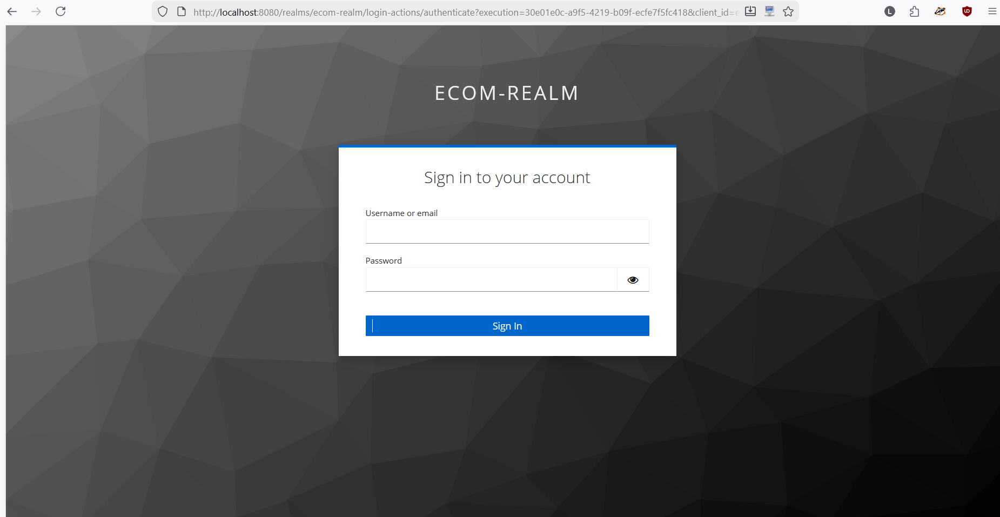

> **📸 Figure 2** : Configuration du client "ecom-client" avec les paramètres OAuth2/OIDC. Le client est configuré en mode "public" pour une application SPA Angular, avec les URLs de redirection correctement définies pour le développement local.

---

## 📸 Captures d'Écran & Démonstrations

### 1️⃣ Service Discovery - Eureka Dashboard

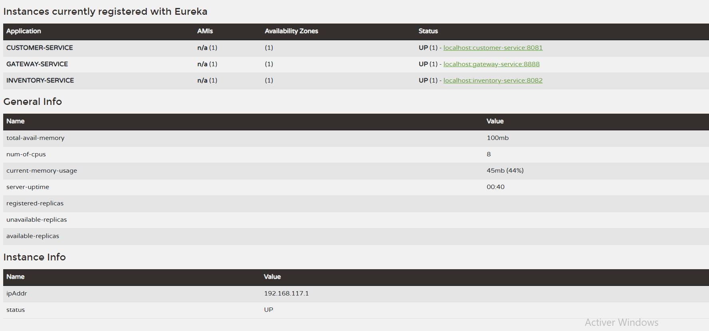

> **📸 Figure 3** : Dashboard Eureka affichant tous les microservices enregistrés. On peut observer que `CUSTOMER-SERVICE`, `INVENTORY-SERVICE`, `BILLING-SERVICE` et `GATEWAY-SERVICE` sont tous **UP** et disponibles. Eureka permet la **découverte automatique des services**, éliminant le besoin de configurer manuellement les adresses IP des services.

---

### 2️⃣ Routage Dynamique via Gateway

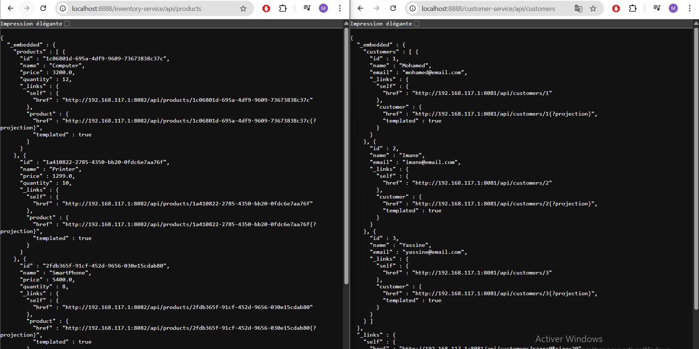

> **📸 Figure 4** : Démonstration du routage dynamique. La Gateway route automatiquement les requêtes vers les microservices enregistrés dans Eureka **sans configuration statique**. Le nom du service (ex: `CUSTOMER-SERVICE`) est utilisé comme préfixe d'URL.

---

### 3️⃣ Customer Service - Gestion des Clients

#### Base de données H2 - Visualisation des données

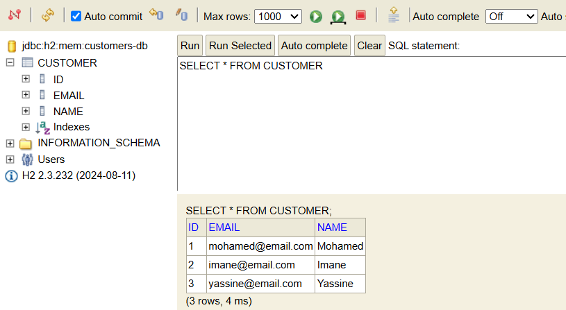

> **📸 Figure 5** : Console H2 affichant la table `CUSTOMER` avec les données des clients. Chaque client possède un `keycloakId` pour l'intégration avec le système d'authentification, permettant de lier l'identité Keycloak aux données métier.

---

#### API REST - Liste des Clients

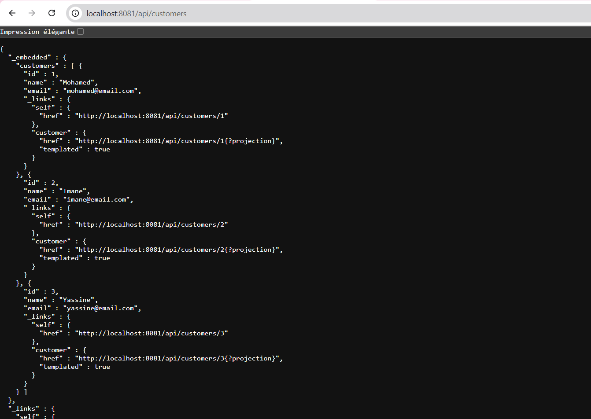

> **📸 Figure 6** : Endpoint REST `/api/customers` retournant la liste paginée des clients au format **HAL+JSON**. Spring Data REST génère automatiquement une API **HATEOAS** complète avec liens de navigation (_links).

---

#### API REST - Récupération d'un Client par ID

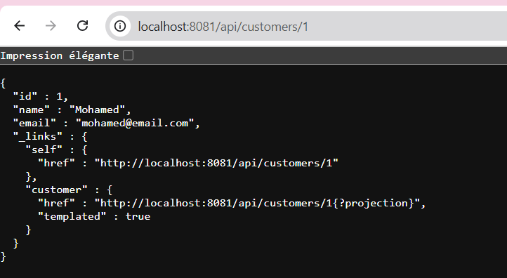

> **📸 Figure 7** : Récupération d'un client spécifique via son ID (`/api/customers/{id}`). Les liens HATEOAS (`_links`) permettent la navigation dans l'API de manière découvrable, facilitant l'exploration par les clients API.

---

#### Projections - Optimisation des Données

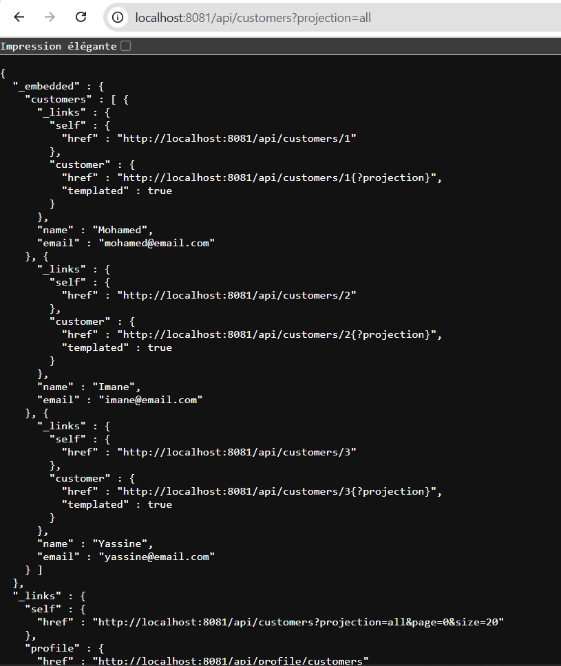

> **📸 Figure 8** : Utilisation des **projections Spring Data REST** pour retourner uniquement les champs nécessaires. Cela optimise la bande passante et améliore les performances en évitant de transférer des données inutiles.

---

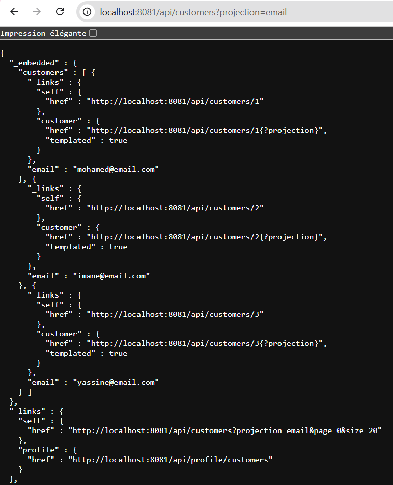

> **📸 Figure 9** : Projection personnalisée affichant uniquement l'email des clients. Très utile pour les **listes déroulantes**, l'**autocomplétion** ou les cas où seule une partie des données est nécessaire.

---

#### Actuator - Monitoring du Service

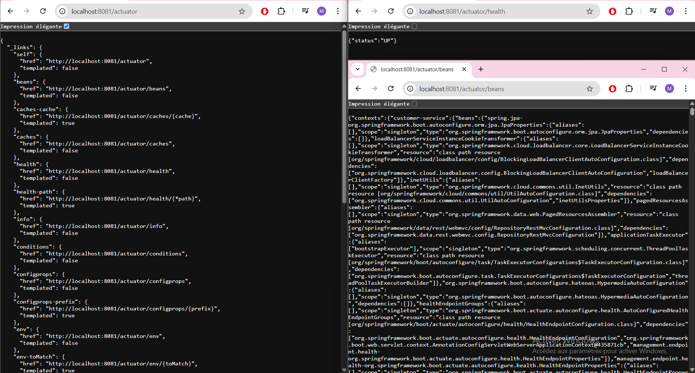

> **📸 Figure 10** : Endpoints **Spring Boot Actuator** exposés pour le monitoring du service. Permet de vérifier la **santé** (`/health`), les **métriques** (`/metrics`), les **informations** (`/info`) et bien plus. Essentiel pour le monitoring en production.

---

### 4️⃣ Inventory Service - Gestion des Produits

#### Base de données H2 - Table Produits

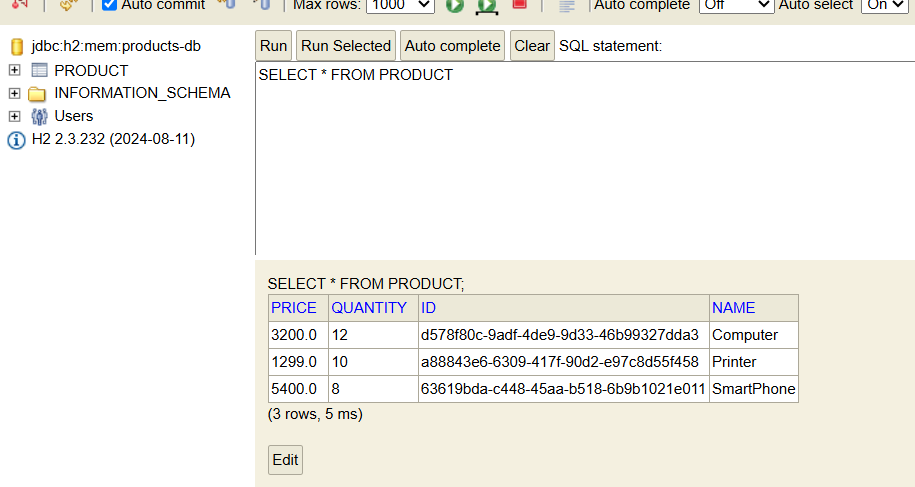

> **📸 Figure 11** : Table `PRODUCT` contenant l'inventaire des produits. Chaque produit possède un `ownerId` permettant d'**associer les produits à leur propriétaire Keycloak**, implémentant ainsi une logique de propriété basée sur l'identité.

---

#### API REST - Liste des Produits

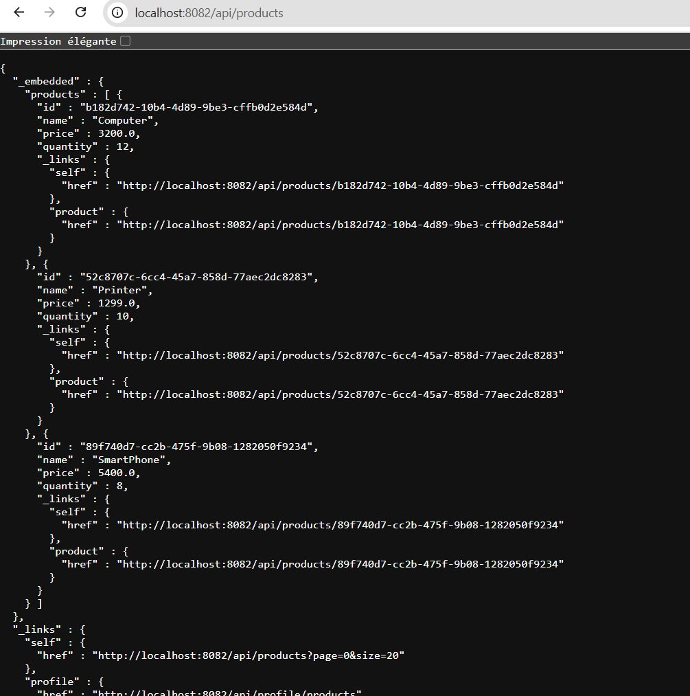

> **📸 Figure 12** : Endpoint `/api/products` retournant tous les produits avec **pagination automatique**. Le format HAL+JSON facilite l'exploration de l'API avec les métadonnées de pagination (`page.size`, `page.totalElements`, etc.).

---

#### API REST - Détail d'un Produit

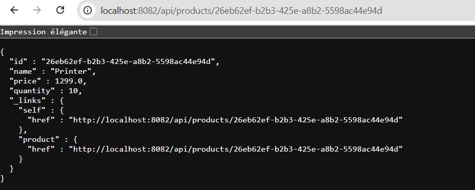

> **📸 Figure 13** : Détails d'un produit spécifique incluant **nom**, **prix**, **quantité** et **propriétaire**. L'API REST générée automatiquement supporte les opérations CRUD complètes.

---

#### Projections Produits

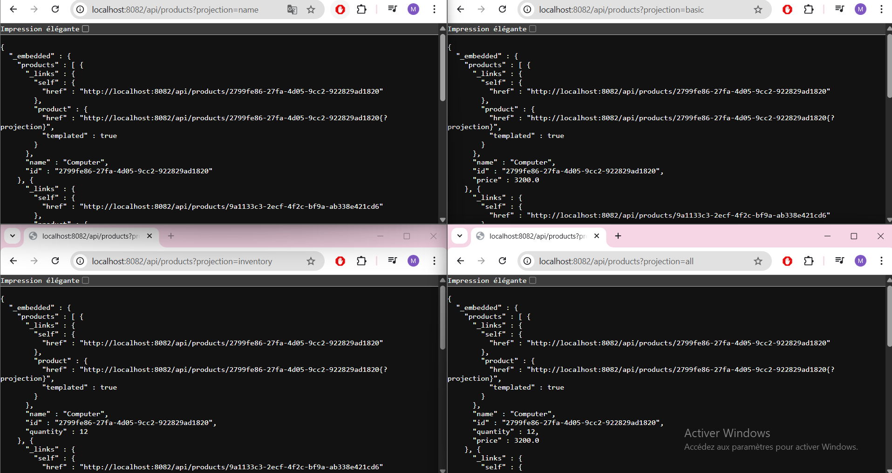

> **📸 Figure 14** : Liste des projections disponibles pour les produits, permettant de **personnaliser les données retournées** selon le contexte d'utilisation (vue liste, vue détaillée, etc.).

---

### 5️⃣ Gateway Service - Point d'Entrée Unifié

#### Accès aux Clients via Gateway

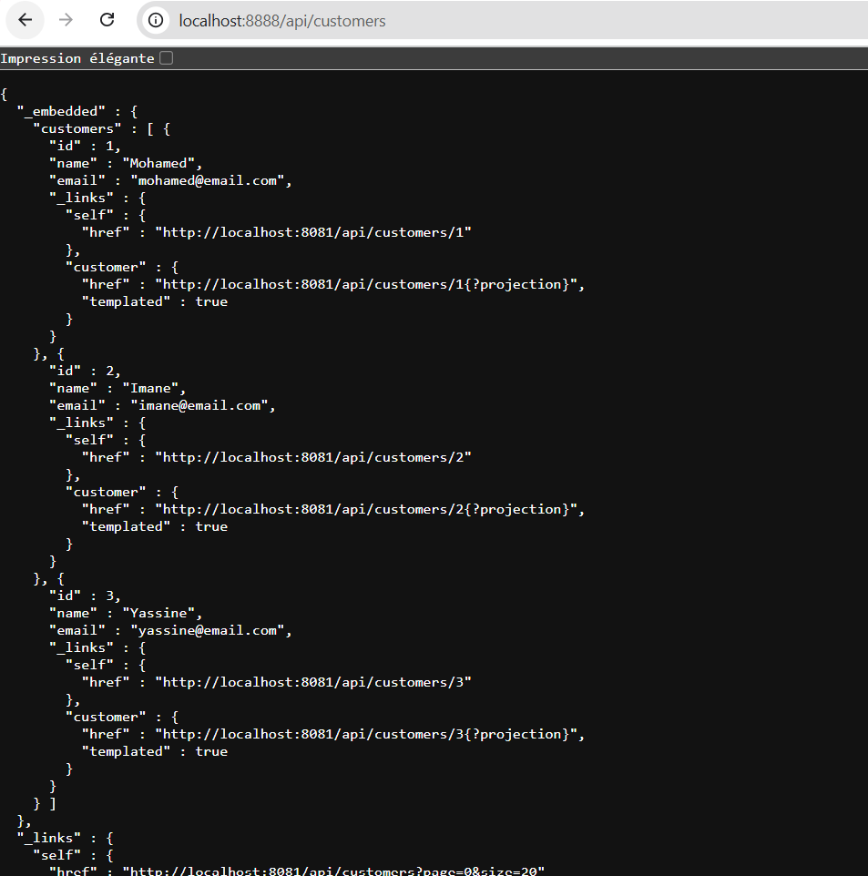

> **📸 Figure 15** : Accès aux clients via la Gateway (port **8888**). La Gateway route `/CUSTOMER-SERVICE/**` vers le microservice Customer. L'URL utilise le **nom du service enregistré dans Eureka**, démontrant le routage dynamique.

---

#### Accès aux Produits via Gateway

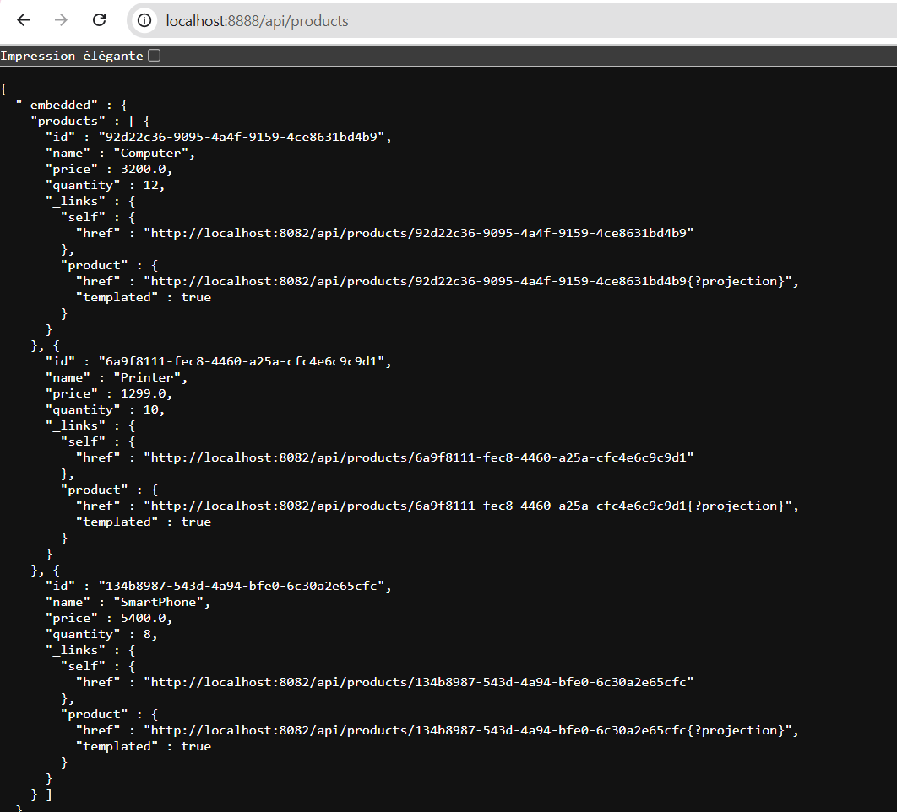

> **📸 Figure 16** : Accès aux produits via la Gateway. **Toutes les requêtes passent par ce point d'entrée unique**, permettant d'appliquer des filtres de sécurité, rate limiting, logging centralisé, etc.

---

### 6️⃣ Config Service - Configuration Centralisée

#### Configuration Globale

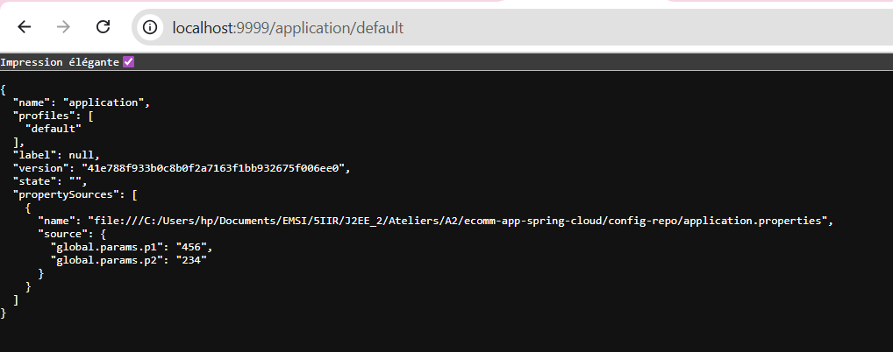

> **📸 Figure 17** : Configuration globale `application.properties` servie par Config Server. Ces propriétés sont **partagées par tous les microservices**, évitant la duplication et centralisant la gestion.

---

#### Configurations Spécifiques par Service

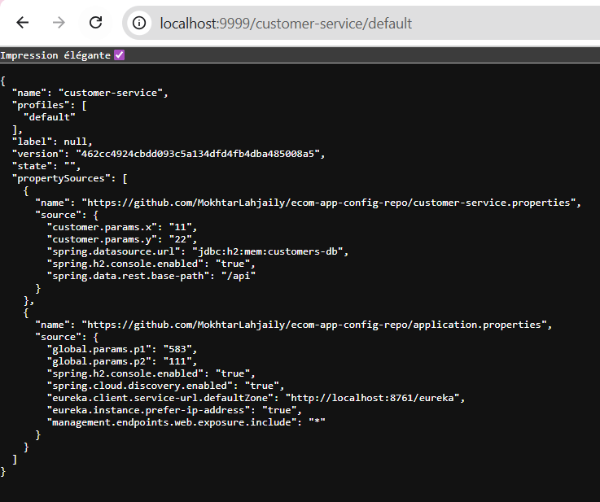

> **📸 Figure 18** : Configuration spécifique au Customer Service récupérée depuis le Config Server. Chaque service peut avoir sa propre configuration tout en héritant des propriétés globales.

---

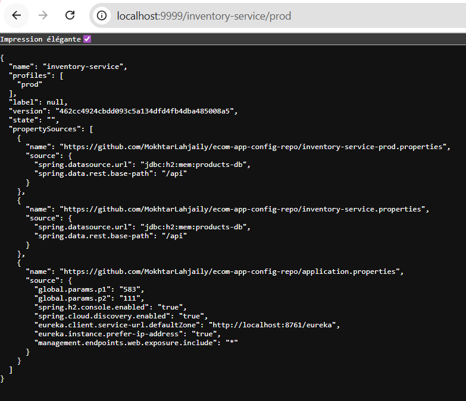

> **📸 Figure 19** : Configuration de l'Inventory Service. Le Config Server **centralise toutes les configurations**, facilitant la maintenance et les changements d'environnement.

---

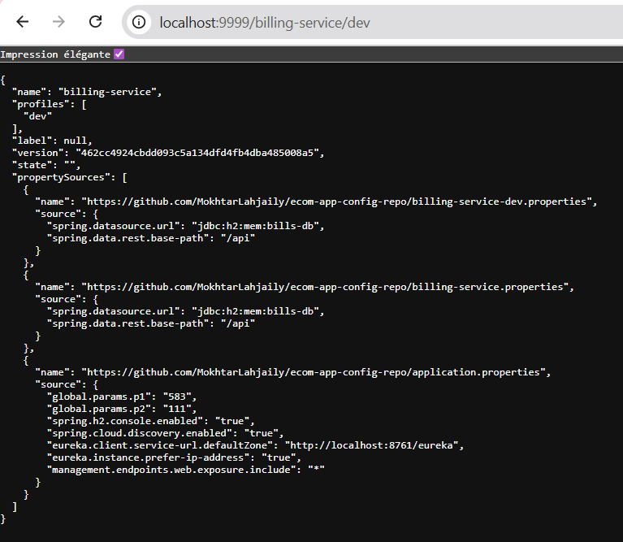

> **📸 Figure 20** : Configuration du Billing Service incluant les paramètres de connexion **Feign** pour la communication inter-services.

---

#### Profils de Configuration (Dev/Prod)

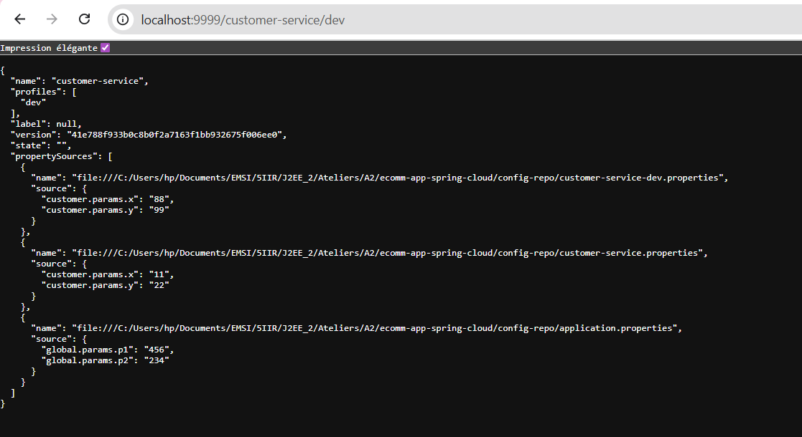

> **📸 Figure 21** : Configuration du profil `dev` pour Customer Service. Les **profils Spring** permettent d'avoir des configurations différentes selon l'environnement (développement, staging, production).

---

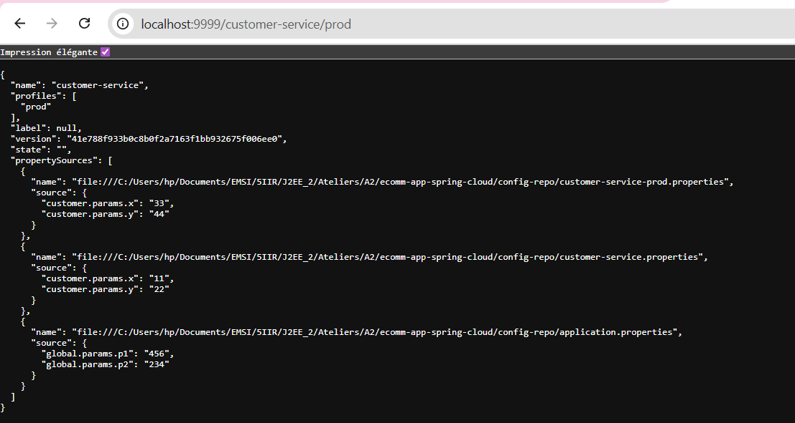

> **📸 Figure 22** : Configuration du profil `prod` pour Customer Service avec des paramètres **optimisés pour la production** (logging réduit, connexions pool, etc.).

---

#### Rafraîchissement de Configuration à Chaud

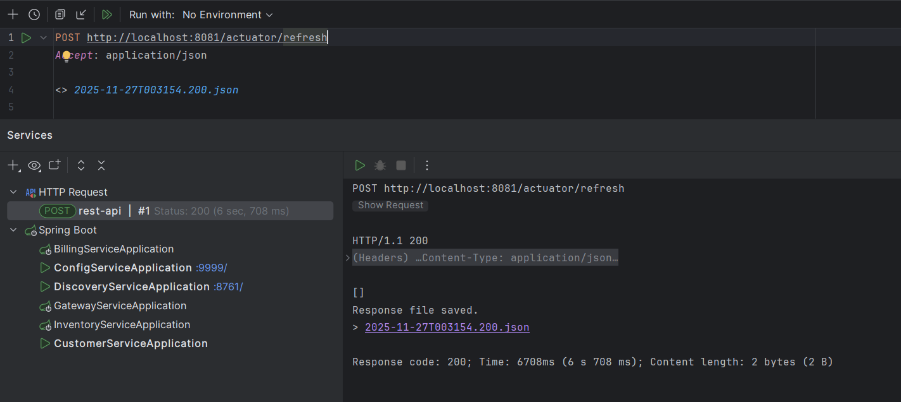

> **📸 Figure 23** : Requête POST vers `/actuator/refresh` permettant de **recharger la configuration à chaud** sans redémarrer le service. Essentiel pour les mises à jour de configuration en production sans downtime.

---

### 7️⃣ Docker Compose - Déploiement Complet

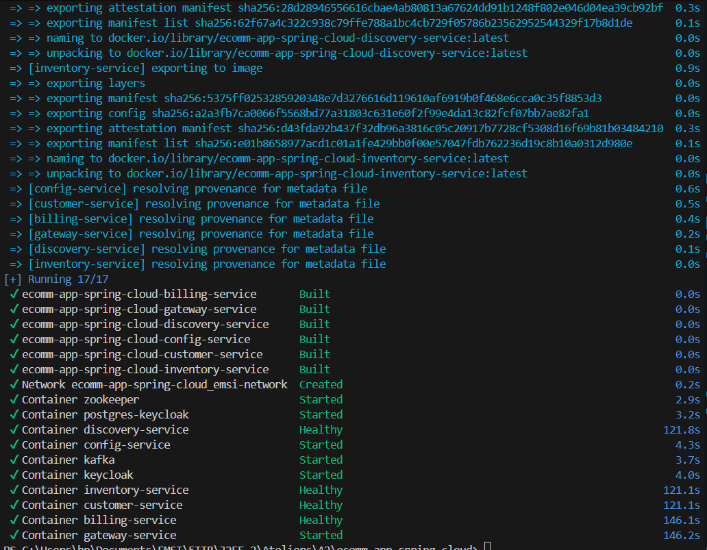

> **📸 Figure 24** : Exécution de `docker-compose up` démarrant l'ensemble de l'infrastructure :
> - ✅ **Eureka** - Service Discovery
> - ✅ **Config Server** - Configuration centralisée
> - ✅ **Microservices métier** - Customer, Inventory, Billing
> - ✅ **Gateway** - Point d'entrée
> - ✅ **Keycloak + PostgreSQL** - Authentification
> - ✅ **Kafka + Zookeeper** - Messaging
>
> Les **healthchecks** garantissent le bon ordre de démarrage avec dépendances respectées.

---

### 8️⃣ Sécurité - Configuration Client Keycloak


> **📸 Figure 25** : Configuration complète du client Keycloak "ecom-client". On peut voir les paramètres OAuth2/OIDC configurés : **Access Type** public, **Valid Redirect URIs**, **Web Origins** pour CORS. Cette configuration permet au frontend Angular de s'authentifier via le flux Authorization Code avec PKCE.

---

### 9️⃣ Analytics Service - Kafka Streams

#### Architecture Analytics avec Kafka

```
┌──────────────────────────────────────────────────────────────────────────┐
│                    FLUX KAFKA ANALYTICS                              │
├──────────────────────────────────────────────────────────────────────────┤
│                                                                          │
│  ┌─────────────────┐      ┌─────────────────┐      ┌─────────────────┐   │
│  │ Inventory Service │─────▶│   Kafka Topic   │─────▶│Analytics Service│   │
│  │     :8082         │      │  visite-topic   │      │     :8084       │   │
│  └─────────────────┘      └─────────────────┘      └────────┴────────┘   │
│         │                                               │                │
│         │ PageEvent                           Kafka Streams               │
│         │ - name: "product-view"                        │                │
│         │ - user: "anonymous"                           │                │
│         │ - date: timestamp                             ▼                │
│         │ - duration: 876ms               ┌──────────────────────┐      │
│         │                                  │   RocksDB State    │      │
│         ▼                                  │      Store         │      │
│  ┌─────────────────┐                      │   "count-store"    │      │
│  │  StreamBridge   │                      └──────────┬───────────┘      │
│  │   Producer      │                                 │                   │
│  └─────────────────┘                                 ▼                   │
│                                            ┌──────────────────────┐      │
│                                            │  Interactive Query │      │
│                                            │      Service       │      │
│                                            └──────────┬───────────┘      │
│                                                       │                   │
│                                                       ▼                   │
│                                            ┌──────────────────────┐      │
│                                            │   REST API         │      │
│                                            │  /api/analytics    │      │
│  ┌─────────────────┐                      └──────────┬───────────┘      │
│  │ Angular Frontend│◀────────────────────────────┘                   │
│  │ Analytics Chart │           Polling every 5s                         │
│  └─────────────────┘                                                      │
│                                                                          │
└──────────────────────────────────────────────────────────────────────────┘
```

> **📸 Figure 26** : Architecture du flux Analytics avec Kafka Streams. L'**Inventory Service** publie des événements `PageEvent` sur le topic `visite-topic` à chaque consultation de produit. L'**Analytics Service** consomme ces événements avec **Kafka Streams**, les agrège par fenêtres temporelles de 5 minutes, et stocke les comptages dans un **State Store RocksDB**. L'API REST expose ces statistiques via **Interactive Query Service**.

#### Composants Clés du Analytics Service

| Composant | Description |
|-----------|-------------|
| **PageEventHandler** | Consumer, Supplier, et KStream pour le traitement des événements |
| **AnalyticsController** | API REST avec endpoints snapshot et SSE streaming |
| **KStream** | Traitement temps réel : filter → map → groupByKey → windowedBy → count |
| **State Store** | RocksDB pour stockage des agrégations (count-store) |
| **Interactive Query** | Interrogation du State Store pour les statistiques |

#### Dashboard Analytics Frontend


> **📸 Figure 27** : Dashboard Analytics dans l'application Angular. Les graphiques affichent les **statistiques de visites produits en temps réel**, agrégées par l'analytics-service via Kafka Streams. Les données sont rafraîchies toutes les 5 secondes.

---

#### Flux Kafka Fonctionnel


> **📸 Figure 28** : Démonstration du flux Kafka fonctionnel de bout en bout. Les événements `PageEvent` sont publiés par inventory-service, consommés et agrégés par analytics-service, puis affichés dans le frontend Angular.

#### Configuration Kafka Streams

```properties
# analytics-service.properties
spring.cloud.stream.bindings.kStream-in-0.destination=visite-topic
spring.cloud.stream.bindings.pageEventConsumer-in-0.destination=visite-topic
spring.cloud.stream.kafka.streams.binder.configuration.default.key.serde=org.apache.kafka.common.serialization.Serdes$StringSerde
spring.cloud.stream.kafka.streams.binder.configuration.default.value.serde=org.springframework.kafka.support.serializer.JsonSerde
```

---

## 📡 API Endpoints

Tous les endpoints sont accessibles via la Gateway (`http://localhost:8888`).

### 📦 Products (Inventory Service)
```http
GET    /INVENTORY-SERVICE/api/products       # Liste des produits
GET    /INVENTORY-SERVICE/api/products/{id}  # Détail produit
POST   /INVENTORY-SERVICE/api/products       # Créer (ADMIN)
PUT    /INVENTORY-SERVICE/api/products/{id}  # Modifier (ADMIN)
DELETE /INVENTORY-SERVICE/api/products/{id}  # Supprimer (ADMIN)
```

### 👥 Customers (Customer Service)
```http
GET    /CUSTOMER-SERVICE/api/customers              # Liste clients
GET    /CUSTOMER-SERVICE/api/customers/{id}         # Client par ID
GET    /CUSTOMER-SERVICE/api/customers/search/current-user  # Client courant
```

### 🧾 Bills (Billing Service)
```http
GET    /BILLING-SERVICE/api/bills/{id}           # Détail facture
GET    /BILLING-SERVICE/api/bills                # Liste factures
```

### 📊 Analytics (Analytics Service - Port 8084)
```http
GET    /api/analytics/snapshot                   # Statistiques agrégées (10 dernières minutes)
GET    /api/analytics/stream                     # Flux SSE temps réel
GET    /analytics                                # Stream SSE principal (1 émission/seconde)
GET    /publish?name=P1&topic=visite-topic       # Publier un événement de test
GET    /api/analytics/health                     # Health check du service
```

---

## 🐳 Commandes Docker Utiles

```bash
# Démarrer tous les services
docker-compose up -d --build

# Voir les logs d'un service spécifique
docker logs -f billing-service

# Redémarrer un service
docker-compose restart billing-service

# Arrêter tous les services
docker-compose down

# Arrêter et supprimer les volumes (reset complet)
docker-compose down -v

# Vérifier l'état de santé
docker-compose ps
```

---

## 📚 Ressources Pédagogiques

Ce projet a été réalisé en suivant les tutoriels du **Prof. Mohamed YOUSSFI** :

| Partie | Sujet | Lien |
|--------|-------|------|
| **Partie 1** | Création des Microservices | [📹 YouTube](https://www.youtube.com/watch?v=fvEg8bOhpo8) |
| **Partie 2** | Gateway & Eureka | [📹 YouTube](https://www.youtube.com/watch?v=yCFSatdQUmE) |
| **Partie 3** | Config Service | [📹 YouTube](https://www.youtube.com/watch?v=-G2rcLMO1gQ) |
| **Frontend** | Client Angular | [📹 YouTube](https://www.youtube.com/watch?v=iMCjDRUXoeM) |
| **Keycloak 1** | Configuration Keycloak | [📹 YouTube](https://www.youtube.com/watch?v=GkdfhMiok3c) |
| **Keycloak 2** | Sécurisation Spring | [📹 YouTube](https://www.youtube.com/watch?v=33B_nQgQaSs) |
| **Keycloak 3** | Sécurisation Angular | [📹 YouTube](https://www.youtube.com/watch?v=YQRYMKbfJTA) |
| **Kafka** | Streaming avec Kafka | [📹 YouTube](https://www.youtube.com/watch?v=8uY7JE_X_Fw) |

### ✅ Travaux Réalisés

- [x] Création du micro-service `customer-service`
- [x] Création du micro-service `inventory-service`
- [x] Création de la Gateway Spring Cloud Gateway
- [x] Configuration statique du système de routage
- [x] Création de l'annuaire Eureka Discovery Service
- [x] Configuration dynamique des routes de la gateway
- [x] Création du service de facturation `billing-service` avec OpenFeign
- [x] Création du service de configuration centralisée
- [x] Intégration Keycloak pour l'authentification OAuth2/OIDC
- [x] Containerisation avec Docker Compose
- [x] Intégration Apache Kafka
- [x] Création du micro-service `analytics-service` avec Kafka Streams
- [x] Implémentation Consumer/Supplier/KStream pour traitement temps réel
- [x] State Store RocksDB pour agrégations fenêtrées
- [x] API REST avec Interactive Query Service
- [x] Configuration CORS pour accès frontend Angular

---

## ✨ Fonctionnalités

- ✅ **Authentification OAuth2/OIDC** avec Keycloak
- ✅ **Service Discovery** avec Netflix Eureka
- ✅ **Configuration Centralisée** avec Spring Cloud Config
- ✅ **API Gateway** avec routage dynamique
- ✅ **Communication Inter-Services** avec OpenFeign
- ✅ **API REST HATEOAS** avec Spring Data REST
- ✅ **Health Checks Docker** avec dépendances
- ✅ **Streaming** avec Apache Kafka
- ✅ **Containerisation complète** avec Docker Compose
- ✅ **Analytics temps réel** avec Kafka Streams
- ✅ **State Store RocksDB** pour agrégations
- ✅ **Interactive Queries** pour exposition REST

---

## 🔗 Liens Utiles

- 🌐 **Frontend Angular** : [https://github.com/MokhtarLahjaily/ecom-app-frontend](https://github.com/MokhtarLahjaily/ecom-app-frontend)
- 📖 **Repository Prof. YOUSSFI** : [https://github.com/mohamedYoussfi/micro-services-app](https://github.com/mohamedYoussfi/micro-services-app)

---

## 👤 Auteur

<div align="center">

**Mohamed Mokhtar LAHJAILY**

🎓 Étudiant Ingénieur - 5ème Année (5IIR)  
🏫 École Marocaine des Sciences de l'Ingénieur (EMSI)  
📅 Année Académique 2025/2026  
📚 Module : J2EE - Architecture Microservices

[](https://github.com/MokhtarLahjaily)

</div>

---

## 🙏 Remerciements

Un grand merci au **Prof. Mohamed YOUSSFI** pour ses tutoriels détaillés et son accompagnement pédagogique tout au long de ce projet.

---

## 📄 Licence

Ce projet est réalisé dans un cadre académique sous la supervision du **Prof. Mohamed YOUSSFI** à l'EMSI.

---

<div align="center">

**⭐ Si ce projet vous a été utile, n'hésitez pas à lui donner une étoile ! ⭐**

</div>
